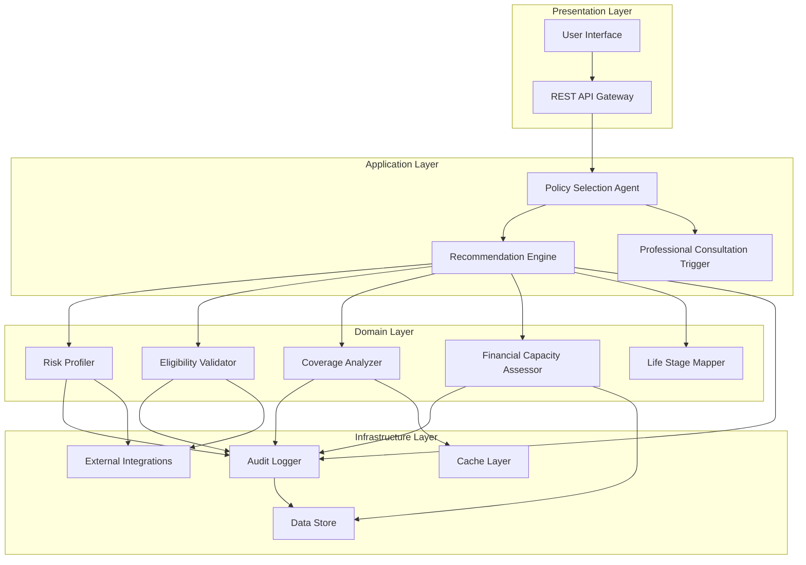

# Design Document: Policy Selection Agent

## Overview

The Policy Selection Agent is a comprehensive insurance recommendation system that combines regulatory compliance, risk assessment, and financial analysis to provide personalized policy recommendations. The system operates as a recommendation-only platform that prioritizes user financial security while maintaining full audit trails for regulatory compliance.

The agent employs a multi-layered architecture that separates concerns between risk profiling, eligibility validation, coverage analysis, and recommendation generation. This design ensures modularity, testability, and compliance with insurance industry regulations including NAIC Model 275 suitability requirements.

Key design principles:
- **Conservative bias**: Err on the side of adequate protection rather than minimal coverage
- **Transparency**: Provide explicit reasoning for all recommendations
- **Compliance-first**: Built-in audit trails and regulatory adherence
- **No autonomous transactions**: Recommendations only, never purchases
- **Graceful degradation**: Continue operating with reduced functionality during failures

## Architecture

The system follows a layered architecture with clear separation of concerns:



### Component Responsibilities

**Policy Selection Agent (PSA)**: Main orchestrator that coordinates all components and manages the overall recommendation workflow.

**Risk Profiler**: Analyzes demographic, geographic, and lifestyle factors to create comprehensive risk profiles using actuarial models.

**Eligibility Validator**: Performs multi-factor screening against insurance provider criteria including age, health, occupation, and location requirements.

**Coverage Analyzer**: Identifies gaps in existing coverage and detects potential over-insurance scenarios through policy overlap analysis.

**Financial Capacity Assessor**: Evaluates user's financial ability to sustain insurance premiums while maintaining financial stability.

**Life Stage Mapper**: Maps insurance products to appropriate life stages and transitions to prevent unsuitable recommendations.

**Recommendation Engine**: Synthesizes inputs from all domain components to generate prioritized, reasoned policy recommendations.

**Professional Consultation Trigger**: Identifies complex scenarios requiring human expert review based on predefined criteria.

**Audit Logger**: Maintains immutable audit trails of all decisions, data inputs, and system interactions for regulatory compliance.

## Components and Interfaces

### Policy Selection Agent Interface

```typescript
interface PolicySelectionAgent {
  generateRecommendations(userProfile: UserProfile): Promise<RecommendationResult>
  validateEligibility(userProfile: UserProfile, policyType: PolicyType): Promise<EligibilityResult>
  analyzeExistingCoverage(policies: ExistingPolicy[]): Promise<CoverageAnalysis>
  assessFinancialCapacity(financialData: FinancialData): Promise<CapacityAssessment>
  triggerProfessionalConsultation(scenario: ComplexScenario): Promise<ConsultationRecommendation>
}
```

### Risk Profiler Interface

```typescript
interface RiskProfiler {
  createRiskProfile(demographics: Demographics, lifestyle: LifestyleFactors): Promise<RiskProfile>
  updateRiskProfile(profileId: string, changes: ProfileChanges): Promise<RiskProfile>
  calculateRiskScore(profile: RiskProfile, policyType: PolicyType): Promise<RiskScore>
  applyActuarialModels(profile: RiskProfile): Promise<ActuarialAssessment>
}

interface RiskProfile {
  profileId: string
  demographics: Demographics
  lifestyle: LifestyleFactors
  geographic: GeographicRisk
  occupation: OccupationRisk
  health: HealthRisk
  riskScores: Map<PolicyType, RiskScore>
  lastUpdated: Date
}
```

### Eligibility Validator Interface

```typescript
interface EligibilityValidator {
  validateEligibility(profile: UserProfile, criteria: EligibilityCriteria): Promise<EligibilityResult>
  checkMultipleFactors(profile: UserProfile, policyTypes: PolicyType[]): Promise<EligibilityMatrix>
  getIneligibilityReasons(result: EligibilityResult): string[]
}

interface EligibilityResult {
  isEligible: boolean
  policyType: PolicyType
  reasons: string[]
  requiredDocuments: string[]
  alternativeOptions: PolicyType[]
}
```

### Coverage Analyzer Interface

```typescript
interface CoverageAnalyzer {
  identifyGaps(existingPolicies: ExistingPolicy[], profile: UserProfile): Promise<CoverageGap[]>
  detectOverInsurance(policies: ExistingPolicy[], profile: UserProfile): Promise<OverInsuranceAlert[]>
  analyzeOverlaps(policies: ExistingPolicy[]): Promise<CoverageOverlap[]>
  prioritizeGaps(gaps: CoverageGap[]): Promise<PrioritizedGap[]>
}

interface CoverageGap {
  gapType: CoverageType
  severity: GapSeverity
  financialExposure: number
  recommendedCoverage: number
  urgency: Priority
  reasoning: string
}
```

### Financial Capacity Assessor Interface

```typescript
interface FinancialCapacityAssessor {
  assessCapacity(financialData: FinancialData): Promise<CapacityAssessment>
  calculateAffordablePremium(income: number, expenses: number, debts: number): Promise<number>
  evaluatePaymentSchedule(capacity: CapacityAssessment, premiumAmount: number): Promise<PaymentSchedule>
  considerIrregularIncome(incomePattern: IncomePattern): Promise<AdjustedCapacity>
}

interface CapacityAssessment {
  maxAffordablePremium: number
  recommendedPremiumLimit: number
  paymentFrequency: PaymentFrequency
  riskTolerance: FinancialRiskTolerance
  emergencyFundAdequacy: boolean
  reasoning: string
}
```

### Recommendation Engine Interface

```typescript
interface RecommendationEngine {
  generateRecommendations(context: RecommendationContext): Promise<PolicyRecommendation[]>
  rankRecommendations(recommendations: PolicyRecommendation[]): Promise<RankedRecommendation[]>
  explainRecommendation(recommendation: PolicyRecommendation): Promise<RecommendationExplanation>
  applyConservativeBias(recommendations: PolicyRecommendation[]): Promise<PolicyRecommendation[]>
}

interface PolicyRecommendation {
  policyId: string
  policyType: PolicyType
  provider: string
  coverageAmount: number
  premium: number
  deductible: number
  suitabilityScore: number
  reasoning: RecommendationReasoning
  riskFactors: string[]
  benefits: string[]
  limitations: string[]
}
```

### Audit Logger Interface

```typescript
interface AuditLogger {
  logDecision(decision: Decision, context: DecisionContext): Promise<AuditEntry>
  logUserInteraction(interaction: UserInteraction): Promise<AuditEntry>
  logSystemEvent(event: SystemEvent): Promise<AuditEntry>
  generateComplianceReport(timeRange: TimeRange): Promise<ComplianceReport>
  ensureImmutability(entry: AuditEntry): Promise<boolean>
}

interface AuditEntry {
  entryId: string
  timestamp: Date
  eventType: AuditEventType
  userId: string
  sessionId: string
  data: any
  checksum: string
  immutable: boolean
}
```

## Data Models

### Core Domain Models

```typescript
interface UserProfile {
  userId: string
  demographics: Demographics
  financialData: FinancialData
  existingPolicies: ExistingPolicy[]
  riskProfile: RiskProfile
  preferences: UserPreferences
  createdAt: Date
  lastUpdated: Date
}

interface Demographics {
  age: number
  gender: Gender
  maritalStatus: MaritalStatus
  dependents: Dependent[]
  occupation: string
  industry: string
  location: Address
  healthStatus: HealthStatus
}

interface FinancialData {
  annualIncome: number
  monthlyExpenses: number
  assets: Asset[]
  debts: Debt[]
  emergencyFund: number
  investmentPortfolio: Investment[]
  creditScore: number
  incomeStability: IncomeStability
}

interface ExistingPolicy {
  policyId: string
  provider: string
  policyType: PolicyType
  coverageAmount: number
  premium: number
  deductible: number
  effectiveDate: Date
  expirationDate: Date
  beneficiaries: string[]
  exclusions: string[]
}

interface RecommendationContext {
  userProfile: UserProfile
  riskProfile: RiskProfile
  eligibilityResults: EligibilityResult[]
  coverageAnalysis: CoverageAnalysis
  capacityAssessment: CapacityAssessment
  lifeStageMapping: LifeStageMapping
  marketConditions: MarketConditions
}
```

### Risk and Assessment Models

```typescript
interface RiskScore {
  score: number
  confidence: number
  factors: RiskFactor[]
  methodology: string
  validUntil: Date
}

interface RiskFactor {
  factor: string
  impact: RiskImpact
  weight: number
  source: string
  explanation: string
}

interface CoverageAnalysis {
  gaps: CoverageGap[]
  overlaps: CoverageOverlap[]
  adequacyScore: number
  recommendations: string[]
  totalExposure: number
}

interface LifeStageMapping {
  currentStage: LifeStage
  transitions: LifeStageTransition[]
  suitableProducts: PolicyType[]
  unsuitableProducts: PolicyType[]
  reasoning: string
}
```

### Compliance and Audit Models

```typescript
interface ComplianceReport {
  reportId: string
  generatedAt: Date
  timeRange: TimeRange
  totalDecisions: number
  auditEntries: AuditEntry[]
  complianceScore: number
  violations: ComplianceViolation[]
  recommendations: string[]
}

interface DecisionContext {
  decisionId: string
  userId: string
  inputData: any
  algorithms: string[]
  dataSource: string[]
  regulatoryFramework: string
  businessRules: string[]
}

interface RecommendationReasoning {
  primaryFactors: string[]
  riskConsiderations: string[]
  financialJustification: string
  regulatoryCompliance: string[]
  alternativesConsidered: string[]
  conservativeBiasApplied: boolean
}
```

### Configuration and Integration Models

```typescript
interface SystemConfiguration {
  riskModelVersions: Map<PolicyType, string>
  eligibilityCriteria: Map<PolicyType, EligibilityCriteria>
  conservativeBiasSettings: ConservativeBiasConfig
  professionalConsultationThresholds: ConsultationThresholds
  auditRetentionPeriod: number
  complianceFrameworks: string[]
}

interface ExternalIntegration {
  providerId: string
  apiEndpoint: string
  authenticationMethod: AuthMethod
  dataMapping: DataMapping
  rateLimits: RateLimit
  failoverStrategy: FailoverStrategy
}
```

## Correctness Properties

*A property is a characteristic or behavior that should hold true across all valid executions of a system—essentially, a formal statement about what the system should do. Properties serve as the bridge between human-readable specifications and machine-verifiable correctness guarantees.*

### Property 1: Eligibility Validation Completeness
*For any* user profile with demographic information, the Policy Selection Agent should validate eligibility against all applicable insurance provider criteria and provide clear reasons when validation fails.
**Validates: Requirements 1.1, 1.2, 1.3, 1.4, 1.5**

### Property 2: Coverage Gap Analysis Comprehensiveness  
*For any* set of existing policies and user profile, the Coverage Analyzer should identify gaps across all insurance types (life, health, disability, property) and quantify the financial risk exposure for each gap.
**Validates: Requirements 2.1, 2.2, 2.3, 2.4, 2.5**

### Property 3: Over-Insurance Prevention
*For any* coverage evaluation scenario, the Policy Selection Agent should prevent recommendations that exceed reasonable coverage needs, including enforcement of the 80% replacement value threshold and 15% disposable income limit.
**Validates: Requirements 3.1, 3.2, 3.3, 3.4, 3.5**

### Property 4: Recommendation-Only Operation
*For any* recommendation generation process, the Policy Selection Agent should never execute purchase transactions and should always indicate that user approval is required for any action.
**Validates: Requirements 4.1, 4.2, 4.4, 4.5**

### Property 5: Conservative Coverage Bias
*For any* uncertain coverage scenario, the Policy Selection Agent should recommend higher coverage within reasonable bounds and prioritize comprehensive options over minimal ones.
**Validates: Requirements 5.1, 5.2, 5.3, 5.4, 5.5**

### Property 6: Comprehensive Suitability Reasoning
*For any* policy recommendation or exclusion, the Recommendation Engine should provide explicit reasoning that explains how demographics, financial situation, risk profile, and life stage considerations influence the decision.
**Validates: Requirements 6.1, 6.2, 6.3, 6.4**

### Property 7: Professional Consultation Triggers
*For any* complex scenario (high-value assets >$1M, complex business structures, special needs dependents, significant estate planning), the Professional Consultation Trigger should recommend expert consultation and provide contact information.
**Validates: Requirements 7.1, 7.2, 7.3, 7.4, 7.5**

### Property 8: Comprehensive Risk Profiling
*For any* user profile, the Risk Profiler should analyze all specified demographic factors (age, gender, occupation, health, lifestyle, geography) using appropriate actuarial models for each insurance type.
**Validates: Requirements 8.1, 8.2, 8.3, 8.4, 8.5**

### Property 9: Financial Capacity Assessment
*For any* financial data input, the Financial Capacity Assessor should analyze all financial factors (income, expenses, assets, debt) and ensure recommendations don't exceed sustainable thresholds while considering irregular income patterns.
**Validates: Requirements 9.1, 9.2, 9.3, 9.4, 9.5**

### Property 10: Data Consistency During Integration
*For any* external system interaction, the Policy Selection Agent should maintain data consistency and synchronization across all integrated systems.
**Validates: Requirements 10.2**

### Property 11: Graceful Failure Handling
*For any* system failure scenario (external data unavailable, calculation errors, component failures), the Policy Selection Agent should continue operating with reduced functionality, provide fallback options, and implement exponential backoff for retries.
**Validates: Requirements 11.1, 11.2, 11.3, 11.4, 11.5**

### Property 12: Comprehensive Audit Trail
*For any* user interaction, recommendation decision, or system event, the Audit Logger should create immutable records with timestamps that capture the complete decision-making process and meet regulatory retention requirements.
**Validates: Requirements 12.1, 12.2, 12.3, 12.4, 12.5**

## Error Handling

The system implements a multi-layered error handling strategy that prioritizes user experience and regulatory compliance:

### Input Validation Layer
- **Data Validation**: All user inputs are validated against defined schemas with clear error messages
- **Business Rule Validation**: Financial and demographic data is validated against business rules
- **Completeness Checks**: Missing required data triggers specific requests for additional information

### Service Layer Error Handling
- **Circuit Breaker Pattern**: Prevents cascading failures when external services are unavailable
- **Graceful Degradation**: Core functionality continues even when non-critical services fail
- **Fallback Mechanisms**: Cached data and default recommendations when real-time data is unavailable

### External Integration Error Handling
- **Retry Logic**: Exponential backoff for transient failures
- **Timeout Management**: Configurable timeouts prevent hanging operations
- **Alternative Data Sources**: Multiple providers for critical data with automatic failover

### Audit and Compliance Error Handling
- **Audit Failure Isolation**: Audit logging failures don't impact core functionality
- **Compliance Alerts**: Immediate notifications for compliance-related errors
- **Data Recovery**: Mechanisms to recover and replay failed audit events

### User-Facing Error Handling
- **Clear Error Messages**: Non-technical language explaining what went wrong and next steps
- **Progressive Disclosure**: Detailed error information available on request
- **Recovery Guidance**: Specific instructions for resolving common error conditions

## Testing Strategy

The Policy Selection Agent employs a comprehensive dual testing approach combining unit tests for specific scenarios and property-based tests for universal correctness guarantees.

### Property-Based Testing Framework

**Framework Selection**: The system uses Hypothesis (Python) for property-based testing, configured to run a minimum of 100 iterations per property test to ensure comprehensive input coverage.

**Property Test Implementation**: Each correctness property from the design document is implemented as a single property-based test with the following tag format:
- **Feature: policy-selection-agent, Property 1: Eligibility Validation Completeness**
- **Feature: policy-selection-agent, Property 2: Coverage Gap Analysis Comprehensiveness**
- And so forth for all 12 properties

**Test Data Generation**: Property tests use sophisticated generators that create:
- Realistic user profiles with varied demographics and financial situations
- Complex existing policy combinations with overlaps and gaps
- Edge cases including boundary conditions for financial thresholds
- Invalid inputs to test error handling and validation

### Unit Testing Strategy

**Focused Unit Tests**: Unit tests complement property tests by focusing on:
- **Specific Examples**: Concrete scenarios that demonstrate correct behavior
- **Integration Points**: Interactions between system components
- **Edge Cases**: Boundary conditions and error scenarios
- **Regulatory Compliance**: Specific compliance requirements and audit trail verification

**Test Coverage Areas**:
- Risk profiling algorithms with known demographic inputs
- Financial capacity calculations with specific income/expense scenarios
- Professional consultation triggers with defined threshold values
- Audit logging with specific event types and data structures

### Integration Testing

**External System Integration**: Tests verify proper integration with:
- Insurance provider APIs for eligibility validation
- Actuarial data sources for risk modeling
- Customer relationship management systems
- Audit and compliance reporting systems

**Failure Scenario Testing**: Comprehensive testing of:
- Network failures and timeouts
- Invalid responses from external services
- Data corruption and inconsistency scenarios
- Performance degradation under load

### Compliance Testing

**Regulatory Validation**: Specialized tests ensure:
- NAIC Model 275 suitability requirements compliance
- Audit trail completeness and immutability
- Data privacy and protection requirements
- Professional consultation trigger accuracy

**Documentation Testing**: Automated verification that:
- All recommendations include required reasoning
- Audit logs contain complete decision context
- Error messages meet clarity and completeness standards
- Compliance reports include all required elements

### Performance and Load Testing

**Scalability Testing**: Verification that the system maintains performance under:
- High user load scenarios
- Large datasets of existing policies
- Complex risk profiling calculations
- Concurrent recommendation generation

**Response Time Testing**: Ensuring that:
- Recommendation generation completes within acceptable timeframes
- Professional consultation triggers activate promptly
- Audit logging doesn't impact user experience
- Error recovery happens quickly and transparently